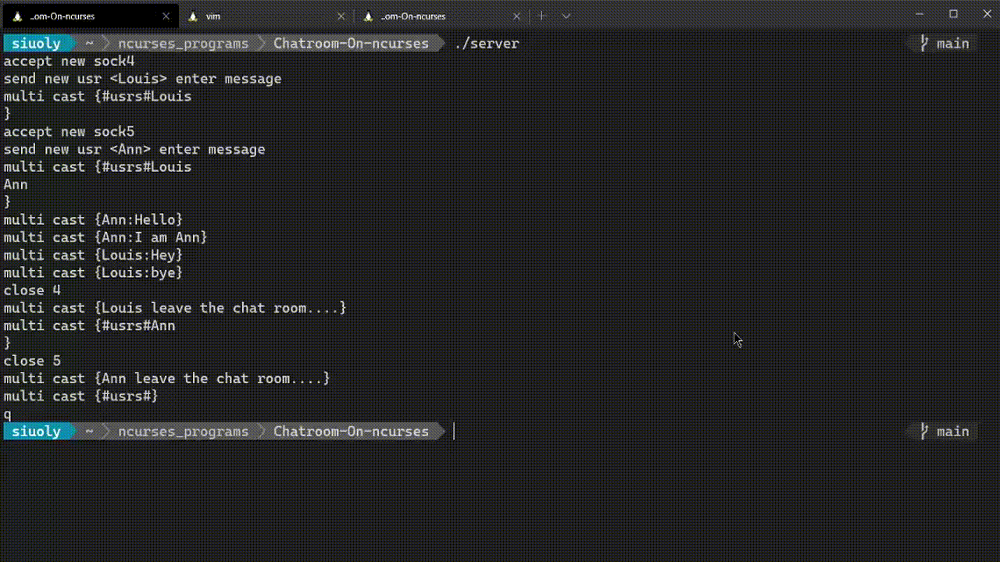

# Chatroom-On-ncurses

> Terminal chatroom using socket, ncurses on c++.

<p align="center">
    </img>
</p>

### Requirements

- C++11 compiler (e.g. `g++`)
- Virtually any platform including:
  - Linux
  - MacOS
  - Windows (via Cygwin or Windows Subsystem for Linux)
- make 

###  Building 

```
git clone "https://github.com/siuoly/Chatroom-On-ncurses.git"
cd Chatroom-On-ncurses
make 
```

### Using

Open three window respectively, run:

```
./server
```

```
./chatroom
```

```
./chatroom
```

#### client input: 

1. `q` :exit
2. `clear` :clean window

#### server input:

1. `q`:	exit
